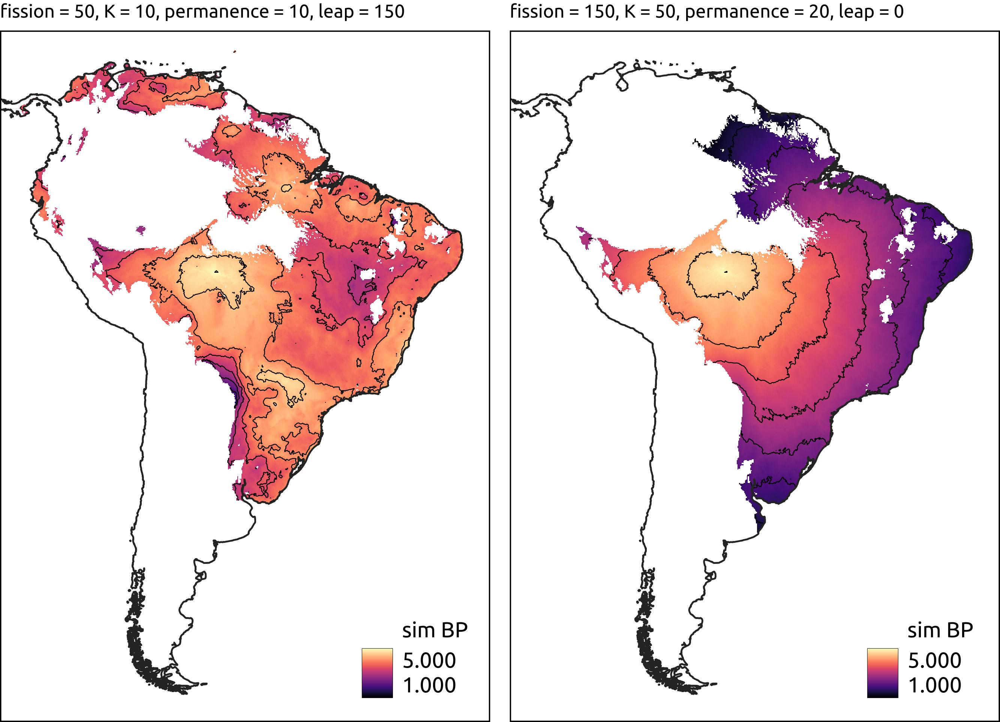

# ExPaND C++

This is a C++ implementation of the agent-based model of South American population expansions originally written in Python (<a>https://github.com/jgregoriods/expand</a>). The model simulates demic diffusion from the growth, fission and relocation of individual villages. For details of the original implementation, see <a href=" https://doi.org/10.1371/journal.pone.0232367">Souza et al. (2020)</a>.

The process of expansion is determined by the following parameters: start date, centre of origin, carrying capacity, growth rate, fission threshold, permanence time and leap distance.

The model starts with a village at the centre of origin. At every time step (corresponding to a year), for every village in the model, the population grows according to the growth rate; if population is above carrying capacity, new cells can be added to the village's catchment. When population is above the fission threshold, the village splits in half and a new village is created, moving to the most suitable cell in the neighborhood, if any. When the neighborhood is saturated, if leapfrogging is allowed, a new search is performed at leap distance. Finally, if a village has been in the same cell longer than the maximum permanence time, a similar procedure is performed to search for a cell to move.

Movement is always directed to the most suitable cell based on suitability raster in the <code>/layers</code> folder. The file currently provided as an example results from a MaxEnt model with <a href="https://github.com/jgregoriods/rxpand">Tupi</a> archaeological sites.

## Usage

```
./expand --date=5000 --site=encontro --fiss=150 --k=20 --r=0.025 --perm=10 --leap=150 --suit=0.25 --show.bar --write
```

The following arguments can be supplied:
* --date : the start date of the simulation (in yr BP).
* --site : the name of the archaeological site to be used as the origin of the expansion. A file with names and respective coordinates is provided in the <code>/coords</code> folder.
* --fiss : fission threshold (persons).
* --k : carrying capacity (in persons/100 km^2).
* --r : annual growth rate (e.g. 0.02 = 2%).
* --perm : permanence time (in yr).
* --leap : leap distance (in km).
* --suit : suitability threshold. Cells with a value below such threshold will not be settled.
* --show-bar : displays a progress bar.
* --write : writes the layer with simulated arrival times to an asc file in the <code>output</code> folder.

Unlike the Python version, at the moment, there is no visualisation of the model as it runs. Evaluation of the model (e.g. by comparing simulated arrival times and real 14C dates) has also not been implemented. The results, however, can be written to a file that can be used for such purposes.

